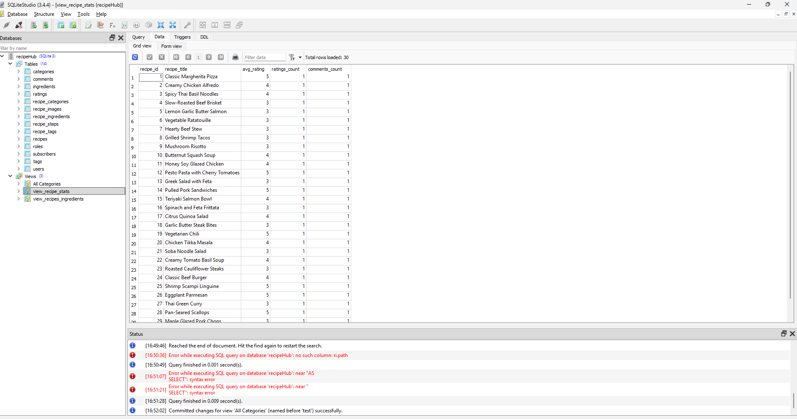
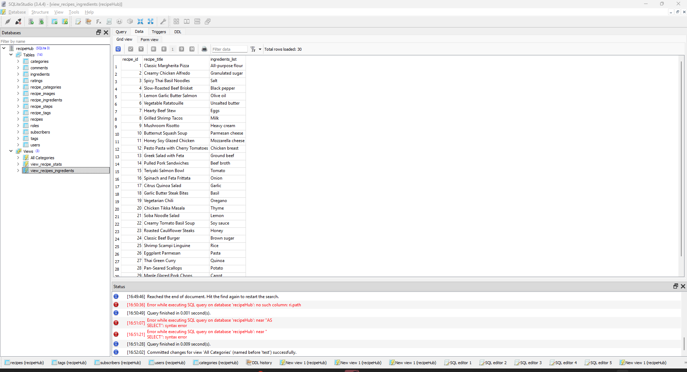
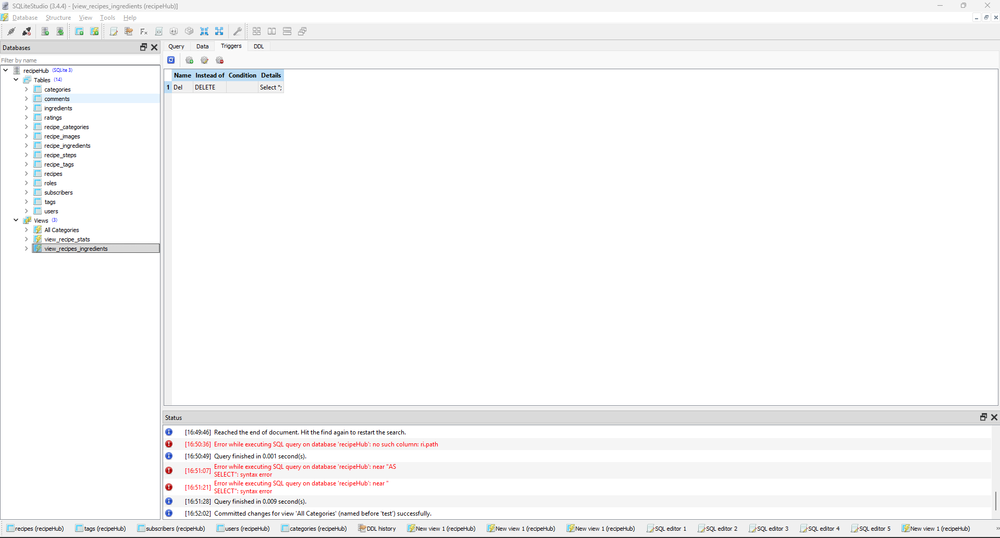
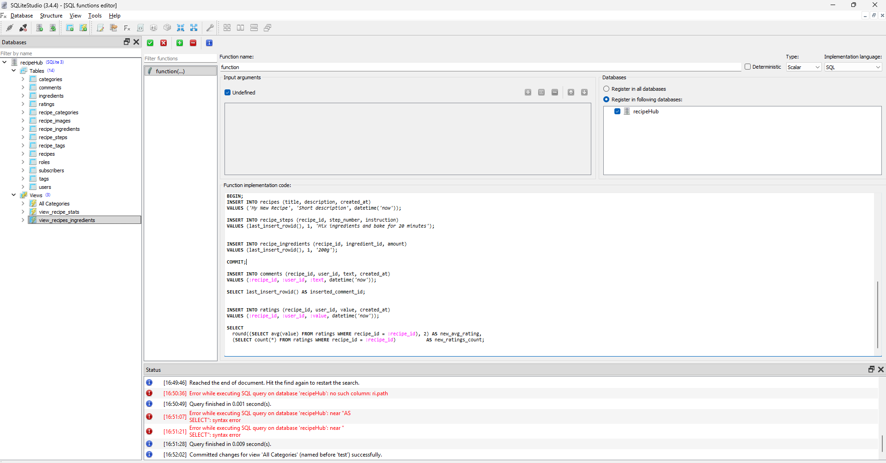
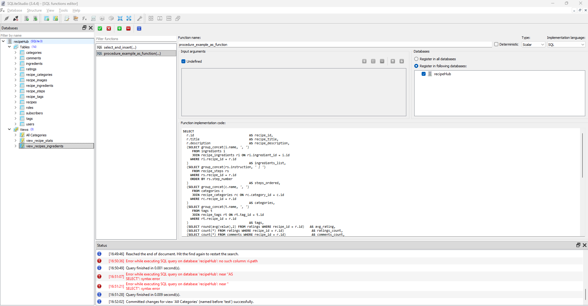

# Sprawozdanie Backend

## Technologie użyte w projekcie

Backend aplikacji RecipeHub został stworzony przy użyciu następujących technologii:

- **Node.js**: Środowisko uruchomieniowe JavaScript, które pozwala na uruchamianie kodu po stronie serwera.
- **TypeScript**: Język programowania będący nadzbiorem JavaScript, zapewniający statyczne typowanie i lepszą kontrolę nad strukturą kodu.
- **TypeORM**: ORM (Object-Relational Mapping) do zarządzania bazą danych, umożliwiający mapowanie obiektów na tabele w bazie danych.
- **GraphQL**: Język zapytań do API, umożliwiający pobieranie danych w elastyczny sposób, z precyzyjnym określeniem struktury odpowiedzi.
- **Apollo Server**: Implementacja serwera GraphQL, która zapewnia obsługę zapytań, mutacji i subskrypcji.
- **SQLite**: Lekka baza danych używana w środowisku deweloperskim.

## Struktura projektu

Projekt backendu jest zorganizowany w modularny sposób, co ułatwia rozwój i utrzymanie. Główne elementy struktury to:

- **package.json**: Plik konfiguracyjny projektu, zawierający zależności i skrypty, np.:

```json
"scripts": {
  "start": "ts-node src/index.ts",
  "seed": "ts-node src/seed.ts"
}
```

- **tsconfig.json**: Konfiguracja TypeScript, definiująca m.in. ścieżki do plików źródłowych i docelowych.
- **src/**: Główny katalog źródłowy, zawierający:
  - **data-source.ts**: Konfiguracja połączenia z bazą danych, np.:

```typescript
import { DataSource } from "typeorm";
import { User } from "./entity/User";

export const AppDataSource = new DataSource({
  type: "sqlite",
  database: "database.sqlite",
  entities: [User],
  synchronize: true,
});
```

- **index.ts**: Punkt wejściowy aplikacji, uruchamiający serwer GraphQL.
- **seed-data.ts** i **seed.ts**: Skrypty do inicjalizacji danych w bazie.
- **typeDefs.ts**: Definicje schematów GraphQL.
- **entity/**: Definicje encji bazy danych.
- **resolvers/**: Implementacje resolverów GraphQL.

## Struktura plików projektu

Poniżej przedstawiono strukturę plików projektu backendu w formie drzewa:

```
backend/
├── package.json
├── tsconfig.json
├── src/
│   ├── data-source.ts
│   ├── index.ts
│   ├── seed-data.ts
│   ├── seed.ts
│   ├── typeDefs.ts
│   ├── entity/
│   │   ├── Category.ts
│   │   ├── Comment.ts
│   │   ├── Ingredient.ts
│   │   ├── Rating.ts
│   │   ├── RecipeCategory.ts
│   │   ├── RecipeImage.ts
│   │   ├── RecipeIngredient.ts
│   │   ├── RecipeStep.ts
│   │   ├── RecipeTag.ts
│   │   ├── Recipies.ts
│   │   ├── Role.ts
│   │   ├── Subscribers.ts
│   │   ├── Tag.ts
│   │   └── User.ts
│   ├── resolvers/
│   │   ├── categoryResolvers.ts
│   │   ├── commentResolvers.ts
│   │   ├── imageResolvers.ts
│   │   ├── ingredientResolvers.ts
│   │   ├── ratingResolvers.ts
│   │   ├── recipeResolvers.ts
│   │   ├── roleResolvers.ts
│   │   ├── subscribersResolvers.ts
│   │   ├── tagResolvers.ts
│   │   └── userResolvers.ts
│   └── images/
```

Struktura ta odzwierciedla modularne podejście do organizacji kodu, gdzie każda funkcjonalność jest odseparowana w odpowiednich katalogach.

## Struktura encji i bazy danych

Encje w projekcie są zdefiniowane w katalogu `src/entity/`. Każda encja odpowiada tabeli w bazie danych. Przykładowa encja `User`:

```typescript
import { Entity, PrimaryGeneratedColumn, Column } from "typeorm";

@Entity()
export class User {
  @PrimaryGeneratedColumn()
  id: number;

  @Column()
  name: string;

  @Column()
  email: string;

  @Column()
  password: string;
}
```

Encje są definiowane za pomocą dekoratorów TypeORM, takich jak `@Entity()`, `@Column()`, `@PrimaryGeneratedColumn()`, co pozwala na łatwe mapowanie obiektowo-relacyjne.

## Sposób implementacji resolverów

Resolvery GraphQL znajdują się w katalogu `src/resolvers/`. Każdy resolver odpowiada za obsługę zapytań, mutacji i subskrypcji dla konkretnego typu danych. Przykładowy resolver dla użytkowników:

```typescript
import { User } from "../entity/User";

export const userResolvers = {
  Query: {
    users: async () => {
      return await User.find();
    },
  },
  Mutation: {
    createUser: async (_: any, { name, email, password }: any) => {
      const user = User.create({ name, email, password });
      await user.save();
      return user;
    },
  },
};
```

Resolvery są zaimplementowane jako obiekty, które definiują funkcje obsługujące zapytania (`Query`) i mutacje (`Mutation`).

## Spójność projektu

Projekt jest spójny dzięki zastosowaniu:

- **TypeScript**: Zapewnia statyczne typowanie, co minimalizuje błędy i ułatwia refaktoryzację.
- **TypeORM**: Ujednolica sposób pracy z bazą danych, umożliwiając łatwe zarządzanie migracjami i relacjami.
- **GraphQL**: Umożliwia elastyczne i jednoznaczne definiowanie API.
- **Modularna struktura katalogów**: Każdy moduł (np. encje, resolvery) jest odseparowany, co ułatwia rozwój i utrzymanie projektu.

## Definicja schematu GraphQL

Schemat GraphQL jest zdefiniowany w pliku `src/typeDefs.ts`. Zawiera definicje typów, zapytań, mutacji i subskrypcji. Przykładowe definicje:

```graphql
type User {
  id: ID!
  name: String!
  email: String!
}

type Query {
  users: [User!]!
}

type Mutation {
  createUser(name: String!, email: String!, password: String!): User!
}
```

Zapytania i mutacje są zdefiniowane w sposób umożliwiający łatwe rozszerzanie funkcjonalności API.

## Dodatkowe punkty

- **Seedowanie danych**: Skrypty `seed-data.ts` i `seed.ts` umożliwiają inicjalizację bazy danych przykładowymi danymi.
- **Obsługa błędów**: Projekt zawiera mechanizmy obsługi błędów, co zapewnia stabilność aplikacji.
- **Wydajność**: Dzięki zastosowaniu GraphQL i TypeORM, aplikacja jest wydajna i łatwa w skalowaniu.
- **Bezpieczeństwo**: Hasła użytkowników są przechowywane w postaci zaszyfrowanej, co zwiększa bezpieczeństwo danych.

## Widoki, Triggery i Funkcje w Bazie Danych

### Widoki w Bazie Danych

Poniżej przedstawiono widoki zaimplementowane w bazie danych. Widoki te umożliwiają łatwiejsze pobieranie danych z różnych tabel w uporządkowany sposób:





---

### Triggery w Bazie Danych

Triggery zostały zaimplementowane w celu automatyzacji pewnych operacji w bazie danych, takich jak aktualizacje lub walidacje danych. Przykład triggera:



---

### Funkcje w Bazie Danych

Funkcje w bazie danych zostały zaimplementowane w celu obsługi logiki, która normalnie byłaby realizowana w procedurach. Ze względu na ograniczenia SQLite, procedury nie są obsługiwane, dlatego logika została przeniesiona do funkcji.



---

### Procedury

Procedury nie są stosowane w SQLite ze względu na jego ograniczenia. Logika, która normalnie byłaby zaimplementowana w procedurach, została przeniesiona do funkcji bazy danych.


