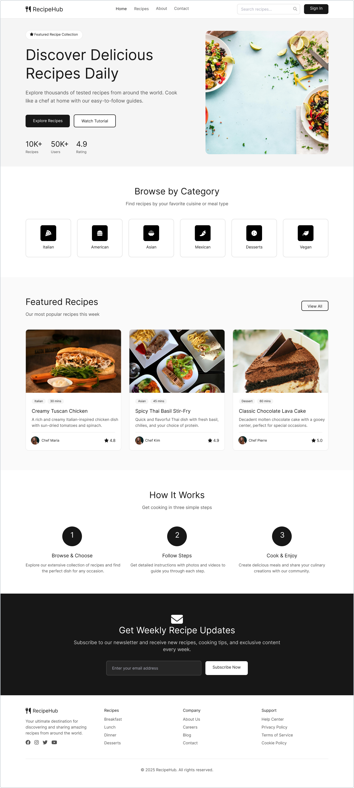
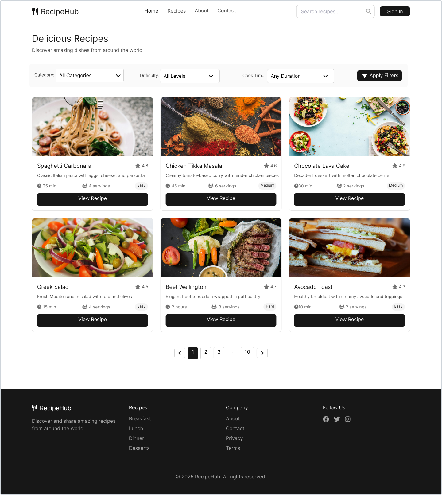
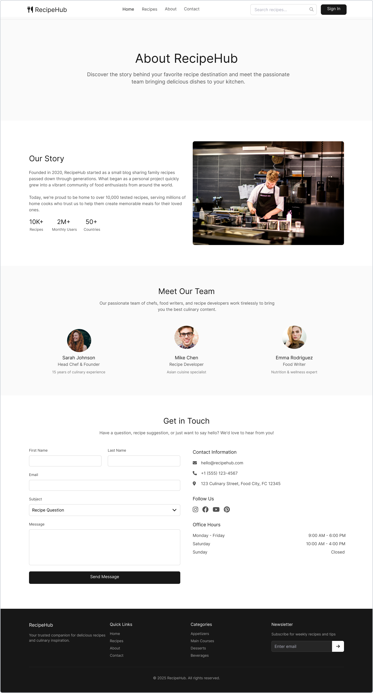
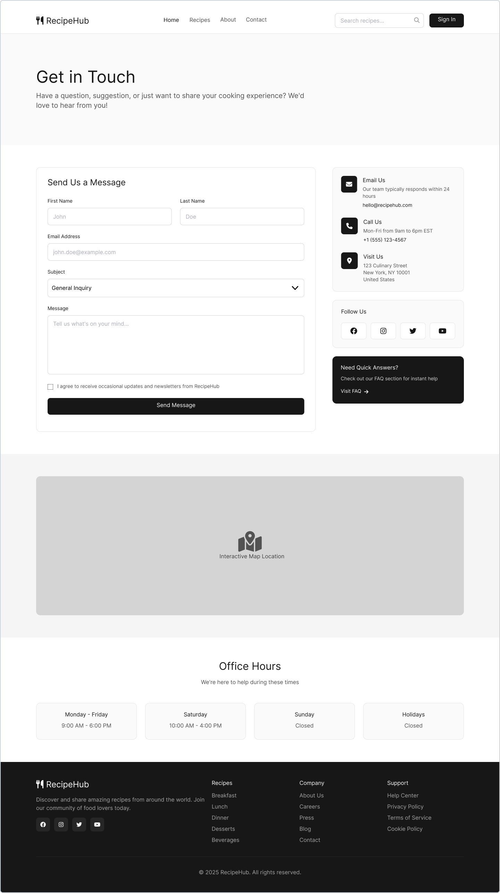
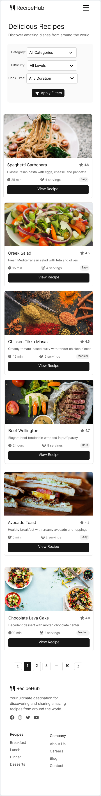
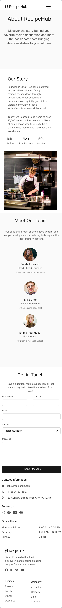
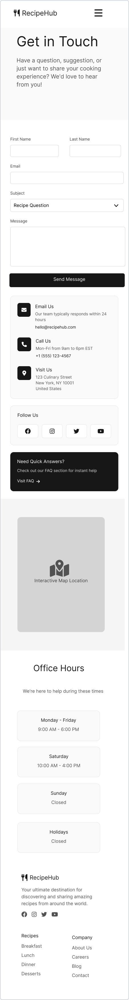

# Sprawozdanie

# UX/UI – RecipeHub

## 1. Wprowadzenie

Celem projektu było zaprojektowanie spójnego, nowoczesnego i intuicyjnego interfejsu użytkownika dla platformy **RecipeHub**, umożliwiającej przeglądanie, wyszukiwanie oraz korzystanie z przepisów kulinarnych. Projekt obejmuje kilka kluczowych widoków: **Home**, **Recipes (lista)**, **Entity View (widok pojedynczego przepisu)**, **About** oraz **Contact**. Wszystkie mockupy zostały wykonane w oparciu o jeden **design system**, co zapewnia spójność wizualną i funkcjonalną całego produktu.

---

## 2. Design system – fundament spójności

### Zastosowana kolorystyka

- **Kolor dominujący:** czerń / bardzo ciemny grafit – wykorzystywany w nagłówkach, przyciskach CTA (np. „Explore Recipes”, „Save Recipe”), stopce
- **Kolory neutralne:** biel oraz jasne odcienie szarości – tło stron, karty, sekcje treści
- **Akcenty kolorystyczne:** naturalne kolory zdjęć potraw (zieleń bazylii, czerwień pomidorów, brązy i beże) – brak agresywnych akcentów UI pozwala skupić uwagę na treści

Taka paleta kolorów wspiera czytelność, nadaje projektowi elegancki i „premium” charakter oraz nie konkuruje wizualnie z fotografiami jedzenia, które są kluczowym elementem serwisu.

### Typografia

- Wyraźna hierarchia nagłówków (duże, pogrubione H1/H2)
- Prosty, bezszeryfowy krój pisma zwiększający czytelność
- Konsekwentne odstępy i interlinie poprawiające skanowalność treści

### Powtarzalne komponenty

- Karty (Cards) przepisów
- Przyciski typu primary / secondary
- Formularze
- Sekcje z wyraźnymi nagłówkami

---

## 3. Analiza poszczególnych widoków

## 3.1 Home (Strona główna)

### Opis struktury

Widok Home pełni funkcję strony wejściowej oraz inspiracyjnej:

- **Header / Navbar** z logo RecipeHub, nawigacją, wyszukiwarką oraz przyciskiem „Sign In”
- **Hero section** z mocnym hasłem („Discover Delicious Recipes Daily”), opisem wartości oraz przyciskami CTA
- **Social proof** – statystyki (liczba przepisów, użytkowników, ocena)
- **Browse by Category** – kafelki kategorii kuchni
- **Featured Recipes** – lista wyróżnionych przepisów w formie kart
- **How It Works** – prosty, 3-krokowy proces korzystania z serwisu
- **Newsletter** – sekcja zapisu
- **Footer** z linkami i informacjami dodatkowymi

### Zastosowanie UX/UI

- Wyraźne CTA w pierwszym ekranie (above the fold)
- Wizualna hierarchia informacji (od inspiracji → eksploracji → edukacji)
- Karty przepisów jako znany i intuicyjny wzorzec
- Ikony kategorii ułatwiające szybkie skanowanie

Home skutecznie łączy funkcję marketingową i użytkową. Użytkownik od razu rozumie wartość produktu i wie, jaki kolejny krok wykonać.

---

## 3.2 Recipes (Lista przepisów)

### Opis struktury

- **Header** z tytułem strony
- **Panel filtrów** (np. kategoria, czas, poziom trudności)
- **Lista przepisów** w formie kart z:

  - zdjęciem
  - nazwą przepisu
  - krótkimi metadanymi
  - przyciskiem „View Recipe"

### Zastosowanie UX/UI

- Filtry ograniczające przeciążenie informacyjne
- Spójne karty jak na Home – brak potrzeby uczenia się nowego wzorca
- Jasne CTA prowadzące do widoku szczegółowego

Widok Recipes jest skalowalny i przygotowany na dużą liczbę treści. Spójność kart z Home wzmacnia przewidywalność interfejsu.

---

## 3.3 Entity View (Widok pojedynczego przepisu)

### Opis struktury

- Breadcrumbs (Home > Italian > Classic Margherita Pizza)
- Tytuł przepisu + metadane (czas, porcje, poziom trudności, ocena)
- Duże zdjęcie potrawy
- Panel akcji (Save, Print, Share)
- Sekcja Nutrition Facts
- Ingredients (checkboxy)
- Instructions w formie kroków
- Related Recipes

### Zastosowanie UX/UI

- Breadcrumbs – orientacja w strukturze serwisu
- Checklisty składników – wsparcie w trakcie gotowania
- Numerowane kroki – redukcja błędów poznawczych
- Sticky / wyróżniony panel akcji

Widok przepisu jest maksymalnie funkcjonalny i wspiera użytkownika w realnym kontekście użycia (gotowanie).

---

## 3.4 About

### Opis struktury

- Header z nagłówkiem „About RecipeHub"
- Sekcja **Our Story** – opis misji i zdjęcie
- **Our Team** – avatary zespołu z podpisami
- **Get In Touch** – formularz kontaktowy + dane kontaktowe

### Zastosowanie UX/UI

- Storytelling budujący zaufanie
- Wizerunki zespołu – humanizacja marki
- Formularz jako naturalne CTA

Widok About wzmacnia wiarygodność produktu i nadaje mu „ludzką twarz”, zachowując tę samą estetykę co pozostałe strony.

---

## 3.5 Contact

### Opis struktury

- Formularz kontaktowy
- Dane kontaktowe (email, telefon, adres)
- Mapa lokalizacji
- Office hours

### Zastosowanie UX/UI

- Jasna separacja informacji
- Mapa jako element wspierający decyzję kontaktu
- Zgodność formularza z innymi formularzami w systemie

Contact jest prosty i funkcjonalny – nie odciąga uwagi od celu, jakim jest szybki kontakt z firmą.

---

## 4. Spójność projektu

Spójność projektu wynika z:

- Jednolitego design systemu
- Powtarzalnych komponentów
- Konsekwentnej typografii i kolorystyki
- Identycznego stylu kart, formularzy i CTA

Dzięki temu użytkownik porusza się po serwisie intuicyjnie, bez potrzeby ponownego uczenia się interfejsu na każdej podstronie.

## Front-End – RecipeHub

## Technologie użyte w projekcie

Frontend aplikacji RecipeHub został stworzony przy użyciu następujących technologii:

- **React**: Biblioteka JavaScript do budowy interfejsów użytkownika.
- **TypeScript**: Język programowania będący nadzbiorem JavaScript, zapewniający statyczne typowanie i lepszą kontrolę nad strukturą kodu.
- **Vite**: Narzędzie do budowy aplikacji, zapewniające szybki czas startu i wydajny proces budowania.
- **GraphQL**: Język zapytań do API, używany do komunikacji z backendem.
- **Apollo Client**: Biblioteka do obsługi GraphQL po stronie klienta, umożliwiająca zarządzanie stanem aplikacji i wykonywanie zapytań do API.
- **CSS Modules**: Mechanizm stylowania komponentów, zapewniający izolację stylów.
- **Chakra UI**: Biblioteka komponentów i design system, zapewniająca spójny wygląd aplikacji oraz łatwość w tworzeniu responsywnych interfejsów użytkownika.

## Struktura projektu

Projekt frontendowy jest zorganizowany w modularny sposób, co ułatwia rozwój i utrzymanie. Główne elementy struktury to:

- **package.json**: Plik konfiguracyjny projektu, zawierający zależności i skrypty, np.:

```json
"scripts": {
  "dev": "vite",
  "build": "vite build",
  "preview": "vite preview"
}
```

- **vite.config.ts**: Konfiguracja narzędzia Vite.
- **src/**: Główny katalog źródłowy, zawierający:
  - **App.tsx**: Główny komponent aplikacji.
  - **main.tsx**: Punkt wejściowy aplikacji, renderujący główny komponent.
  - **components/**: Katalog z komponentami wielokrotnego użytku, np.:
    - **Navbar.tsx**: Pasek nawigacyjny.
    - **Footer.tsx**: Stopka aplikacji.
  - **Views/**: Katalog z widokami aplikacji, np.:
    - **Home/**: Widok strony głównej.
    - **About/**: Widok strony "O nas".
    - **Contact/**: Widok strony kontaktowej.
  - **services/**: Katalog z logiką komunikacji z backendem, np.:
    - **graphql.tsx**: Konfiguracja Apollo Client i zapytania GraphQL.

## Komunikacja z backendem

Komunikacja z backendem odbywa się za pomocą GraphQL i biblioteki Apollo Client. Przykładowa konfiguracja Apollo Client:

```typescript
import { ApolloClient, InMemoryCache } from "@apollo/client";

const client = new ApolloClient({
  uri: "http://localhost:5000/graphql",
  cache: new InMemoryCache(),
});

export default client;
```

Zapytania GraphQL są definiowane w pliku `graphql.tsx` i wykonywane w komponentach za pomocą hooków, np.:

```typescript
import { gql, useQuery } from "@apollo/client";

const GET_RECIPES = gql`
  query GetRecipes {
    recipes {
      id
      title
      description
    }
  }
`;

const Recipes = () => {
  const { loading, error, data } = useQuery(GET_RECIPES);

  if (loading) return <p>Loading...</p>;
  if (error) return <p>Error: {error.message}</p>;

  return (
    <ul>
      {data.recipes.map((recipe: any) => (
        <li key={recipe.id}>{recipe.title}</li>
      ))}
    </ul>
  );
};

export default Recipes;
```

## Stylowanie

Stylowanie komponentów odbywa się za pomocą CSS Modules. Przykład użycia:

```css
/* App.module.css */
.container {
  display: flex;
  justify-content: center;
  align-items: center;
}
```

```typescript
import styles from "./App.module.css";

const App = () => {
  return <div className={styles.container}>Welcome to RecipeHub!</div>;
};

export default App;
```

## Chakra UI

W projekcie RecipeHub wykorzystano bibliotekę Chakra UI jako design system. Chakra UI dostarcza gotowe komponenty, które są łatwe w użyciu, responsywne i dostosowane do różnych urządzeń. Dzięki temu możliwe jest szybkie tworzenie estetycznych i spójnych interfejsów użytkownika.

### Przykład zastosowania Chakra UI w komponencie

Poniżej przedstawiono przykład użycia komponentów Chakra UI w komponencie `HeroHeader`:

```typescript
import { Box, Heading, Text, Button } from "@chakra-ui/react";

const HeroHeader = () => {
  return (
    <Box
      bgGradient="linear(to-r, teal.500, green.500)"
      color="white"
      textAlign="center"
      py={10}
      px={5}
    >
      <Heading as="h1" size="2xl" mb={4}>
        Witaj w RecipeHub!
      </Heading>
      <Text fontSize="lg" mb={6}>
        Odkrywaj i dziel się swoimi ulubionymi przepisami kulinarnymi.
      </Text>
      <Button colorScheme="teal" size="lg">
        Rozpocznij teraz
      </Button>
    </Box>
  );
};

export default HeroHeader;
```

### Wyjaśnienie kodu

- **Box**: Kontener z możliwością stylizacji, użyty do stworzenia tła gradientowego i wyrównania tekstu.
- **Heading**: Komponent do wyświetlania nagłówków, z wbudowanymi stylami.
- **Text**: Komponent do wyświetlania tekstu z możliwością dostosowania rozmiaru i odstępów.
- **Button**: Przycisk z predefiniowanymi stylami i obsługą różnych schematów kolorów.

Chakra UI znacząco przyspiesza proces tworzenia interfejsów użytkownika, zapewniając jednocześnie spójność wizualną w całej aplikacji.

## Spójność projektu

Projekt jest spójny dzięki zastosowaniu:

- **TypeScript**: Zapewnia statyczne typowanie, co minimalizuje błędy i ułatwia refaktoryzację.
- **Apollo Client**: Ujednolica sposób komunikacji z backendem.
- **CSS Modules**: Zapewnia izolację stylów, co minimalizuje konflikty.
- **Modularna struktura katalogów**: Każdy moduł (np. komponenty, widoki) jest odseparowany, co ułatwia rozwój i utrzymanie projektu.

## Dodatkowe punkty

- **Responsywność**: Aplikacja została zaprojektowana w sposób responsywny, aby działała poprawnie na różnych urządzeniach.
- **Wydajność**: Dzięki zastosowaniu Vite, aplikacja ładuje się szybko i działa wydajnie.
- **Łatwość rozbudowy**: Modularna struktura i użycie GraphQL umożliwiają łatwe dodawanie nowych funkcjonalności.
- **Testowanie**: Projekt zawiera podstawowe testy jednostkowe dla kluczowych komponentów.

# Back-End – RecipeHub

## Technologie użyte w projekcie

Backend aplikacji RecipeHub został stworzony przy użyciu następujących technologii:

- **Node.js**: Środowisko uruchomieniowe JavaScript, które pozwala na uruchamianie kodu po stronie serwera.
- **TypeScript**: Język programowania będący nadzbiorem JavaScript, zapewniający statyczne typowanie i lepszą kontrolę nad strukturą kodu.
- **TypeORM**: ORM (Object-Relational Mapping) do zarządzania bazą danych, umożliwiający mapowanie obiektów na tabele w bazie danych.
- **GraphQL**: Język zapytań do API, umożliwiający pobieranie danych w elastyczny sposób, z precyzyjnym określeniem struktury odpowiedzi.
- **Apollo Server**: Implementacja serwera GraphQL, która zapewnia obsługę zapytań, mutacji i subskrypcji.
- **SQLite**: Lekka baza danych używana w środowisku deweloperskim.

## Struktura projektu

Projekt backendu jest zorganizowany w modularny sposób, co ułatwia rozwój i utrzymanie. Główne elementy struktury to:

- **package.json**: Plik konfiguracyjny projektu, zawierający zależności i skrypty, np.:

```json
"scripts": {
  "start": "ts-node src/index.ts",
  "seed": "ts-node src/seed.ts"
}
```

- **tsconfig.json**: Konfiguracja TypeScript, definiująca m.in. ścieżki do plików źródłowych i docelowych.
- **src/**: Główny katalog źródłowy, zawierający:
  - **data-source.ts**: Konfiguracja połączenia z bazą danych, np.:

```typescript
import { DataSource } from "typeorm";
import { User } from "./entity/User";

export const AppDataSource = new DataSource({
  type: "sqlite",
  database: "database.sqlite",
  entities: [User],
  synchronize: true,
});
```

- **index.ts**: Punkt wejściowy aplikacji, uruchamiający serwer GraphQL.
- **seed-data.ts** i **seed.ts**: Skrypty do inicjalizacji danych w bazie.
- **typeDefs.ts**: Definicje schematów GraphQL.
- **entity/**: Definicje encji bazy danych.
- **resolvers/**: Implementacje resolverów GraphQL.

## Struktura plików projektu

Poniżej przedstawiono strukturę plików projektu backendu w formie drzewa:

```
backend/
├── package.json
├── tsconfig.json
├── src/
│   ├── data-source.ts
│   ├── index.ts
│   ├── seed-data.ts
│   ├── seed.ts
│   ├── typeDefs.ts
│   ├── entity/
│   │   ├── Category.ts
│   │   ├── Comment.ts
│   │   ├── Ingredient.ts
│   │   ├── Rating.ts
│   │   ├── RecipeCategory.ts
│   │   ├── RecipeImage.ts
│   │   ├── RecipeIngredient.ts
│   │   ├── RecipeStep.ts
│   │   ├── RecipeTag.ts
│   │   ├── Recipies.ts
│   │   ├── Role.ts
│   │   ├── Subscribers.ts
│   │   ├── Tag.ts
│   │   └── User.ts
│   ├── resolvers/
│   │   ├── categoryResolvers.ts
│   │   ├── commentResolvers.ts
│   │   ├── imageResolvers.ts
│   │   ├── ingredientResolvers.ts
│   │   ├── ratingResolvers.ts
│   │   ├── recipeResolvers.ts
│   │   ├── roleResolvers.ts
│   │   ├── subscribersResolvers.ts
│   │   ├── tagResolvers.ts
│   │   └── userResolvers.ts
│   └── images/
```

Struktura ta odzwierciedla modularne podejście do organizacji kodu, gdzie każda funkcjonalność jest odseparowana w odpowiednich katalogach.

## Struktura encji i bazy danych

Encje w projekcie są zdefiniowane w katalogu `src/entity/`. Każda encja odpowiada tabeli w bazie danych. Przykładowa encja `User`:

```typescript
import { Entity, PrimaryGeneratedColumn, Column } from "typeorm";

@Entity()
export class User {
  @PrimaryGeneratedColumn()
  id: number;

  @Column()
  name: string;

  @Column()
  email: string;

  @Column()
  password: string;
}
```

Encje są definiowane za pomocą dekoratorów TypeORM, takich jak `@Entity()`, `@Column()`, `@PrimaryGeneratedColumn()`, co pozwala na łatwe mapowanie obiektowo-relacyjne.

## Sposób implementacji resolverów

Resolvery GraphQL znajdują się w katalogu `src/resolvers/`. Każdy resolver odpowiada za obsługę zapytań, mutacji i subskrypcji dla konkretnego typu danych. Przykładowy resolver dla użytkowników:

```typescript
import { User } from "../entity/User";

export const userResolvers = {
  Query: {
    users: async () => {
      return await User.find();
    },
  },
  Mutation: {
    createUser: async (_: any, { name, email, password }: any) => {
      const user = User.create({ name, email, password });
      await user.save();
      return user;
    },
  },
};
```

Resolvery są zaimplementowane jako obiekty, które definiują funkcje obsługujące zapytania (`Query`) i mutacje (`Mutation`).

## Spójność projektu

Projekt jest spójny dzięki zastosowaniu:

- **TypeScript**: Zapewnia statyczne typowanie, co minimalizuje błędy i ułatwia refaktoryzację.
- **TypeORM**: Ujednolica sposób pracy z bazą danych, umożliwiając łatwe zarządzanie migracjami i relacjami.
- **GraphQL**: Umożliwia elastyczne i jednoznaczne definiowanie API.
- **Modularna struktura katalogów**: Każdy moduł (np. encje, resolvery) jest odseparowany, co ułatwia rozwój i utrzymanie projektu.

## Definicja schematu GraphQL

Schemat GraphQL jest zdefiniowany w pliku `src/typeDefs.ts`. Zawiera definicje typów, zapytań, mutacji i subskrypcji. Przykładowe definicje:

```graphql
type User {
  id: ID!
  name: String!
  email: String!
}

type Query {
  users: [User!]!
}

type Mutation {
  createUser(name: String!, email: String!, password: String!): User!
}
```

Zapytania i mutacje są zdefiniowane w sposób umożliwiający łatwe rozszerzanie funkcjonalności API.

## Dodatkowe punkty

- **Seedowanie danych**: Skrypty `seed-data.ts` i `seed.ts` umożliwiają inicjalizację bazy danych przykładowymi danymi.
- **Obsługa błędów**: Projekt zawiera mechanizmy obsługi błędów, co zapewnia stabilność aplikacji.
- **Wydajność**: Dzięki zastosowaniu GraphQL i TypeORM, aplikacja jest wydajna i łatwa w skalowaniu.
- **Bezpieczeństwo**: Hasła użytkowników są przechowywane w postaci zaszyfrowanej, co zwiększa bezpieczeństwo danych.

## Screeny aplikacji

Poniżej znajdują się screeny aplikacji przedstawiające różne widoki na urządzeniach desktopowych i mobilnych.

### Desktop

- **Home**



- **Recipes**



- **Entity View**


- **About**



- **Contact**



### Mobile

- **Home**


- **Recipes**



- **Entity View**


- **About**



- **Contact**


